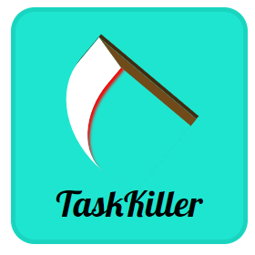
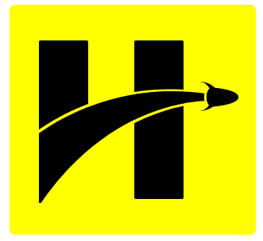
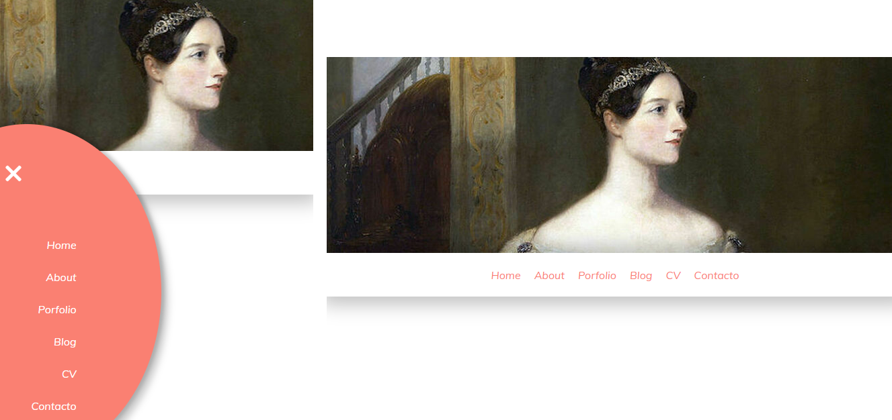

<h2> Hi! I'm Emilia</h2>

  <h3> 🌱  I'm currently learning Fullstack Web Development at SoyHenry</h3>
   
      <il>
        <li> [x] HTML </li>
        <li> [x] CSS </li>
        <li> [x] GIT </li>
        <li> [x] LESS </li>
        <li> [x] Javascript </li>
        <li> [x] Search Algorithms </li>
        <li> [x] Discrete Structures </li>
        <li> [X] DOM </li>
        <li> [X] API request </li>
        <li> [x] AJAX </li>
        <li> [x] React.js </li>
        <li> [ ] API release </li> 
        <li> [ ] Node.js </li>
        <li> [ ] Microservices </li>
        <li> [ ] Testing </li>
      </il>
     
  <h3> ⚡  Practice repositories:</h3></li> 
        
 
            <dl>
                <dt>Pure CSS</dt>
                <dd>-> https://github.com/Em3c2/TaskKillerIconCSS </dd>
                 
                   
                <dd>-> https://github.com/Em3c2/HenryLogoCss </dd>
                
                   
                <dt>Pure CSS and JS Vanilla</dt>
                <dd>-> https://github.com/Em3c2/ResponsiveWebCSS </dd>
                
            </dl>
        

    

    <h3> 📫  For more information, you can find me in <a href="https://www.linkedin.com/in/em3c2">LinkedIn</a></h3>

   

<!--
**Em3c2/Em3c2** is a ✨ _special_ ✨ repository because its `README.md` (this file) appears on your GitHub profile.

Here are some ideas to get you started:

- 🔭 I’m currently working on ...
- 🌱 I’m currently learning ...
- 👯 I’m looking to collaborate on ...
- 🤔 I’m looking for help with ...
- 💬 Ask me about ...
- 📫 How to reach me: ...
- 😄 Pronouns: ...
- ⚡ Fun fact: ...
-->
